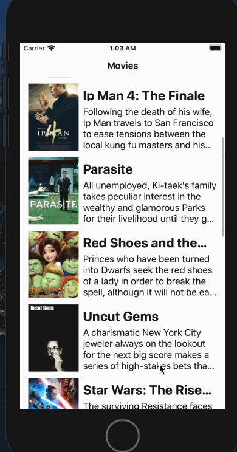

# Flix

**Flix** is an app that allows users to browse movies from the [The Movie Database API](http://docs.themoviedb.apiary.io/#).

Submitted by : **Adam Smith**

Time spent: **10** hours spent at least

📝 `NOTE - PASTE PART 2 SNIPPET HERE:` Paste the README template for part 2 of this assignment here at the top. This will show a history of your development process, which users stories you completed and how your app looked and functioned at each step.

---

## Flix Part 1

### User Stories
`TODO://` In the **User Stories section below**, add an `x` in the `-[ ]` like this `- [x]` for any user story you complete. (🚫 Remove this paragraph after after checking off completed user stories)

#### REQUIRED (10pts)
- [x] (2pts) User sees an app icon on the home screen and a styled launch screen.
- [x] (5pts) User can view and scroll through a list of movies now playing in theaters.
- [x] (3pts) User can view the movie poster image for each movie.

#### BONUS
- [ ] (2pt) User can view the app on various device sizes and orientations.
- [ ] (1pt) Run your app on a real device.

### App Walkthough GIF
 

### Notes
Describe any challenges encountered while building the app.

-Getting Cocoapods to run the Alamofireimage pod loaded in the Init file.
The dependencies that I was adding to the podfile were different from the guide to the Video.
Time used AlamofireImage, and the guide was Alamofire with extra infro for version info.

After I sorted through the version and specific name, I didn't automatically load OAuthSwift, and OAuthSwiftAlamofire. In actuality, I was able to get OAuthSwift working, but not the latter. I then ended up commenting out the dependency.

-I saw a warning about "automatically assigning platform ios with version 12.2"
I as well noticed it was on Tim's video so I was finicky, but happy with moving forward and not being perfect.

- af_setimage not wasn't loading in XCode as I was working with Tim.
I was getting and error, "command compileswiftsources failed with a nonzero exit code."
-Through GitHub I found a workaround:
Workaround: Disable batch mode by adding a user-defined build setting named SWIFT_ENABLE_BATCH_MODE and set it to NO
Source-
[Github Help from User ylin0x81 - Command CompileSwiftSources failed with a nonzero exit code](https://github.com/Yummypets/YPImagePicker/issues/236)

Tim point out I would need to clean and maybe build again- 

What I saw was that earlier when I was working to set Cocoa Pods up Tim, when he was working in the terminal, let me know that his file was on his desktop. I had copied my code to my desktop therefore. 
I noticed that I had two MoviesViewController files in XCode. So I removed that and was back on my path.
